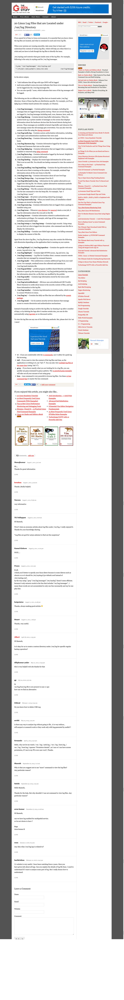

#20 types of linux server log file:
http://www.thegeekstuff.com/2011/08/linux-var-log-files/

	/var/log/messages – Contains global system messages, including the messages that are logged during system startup. There are several things that are logged in /var/log/messages including mail, cron, daemon, kern, auth, etc.
	/var/log/dmesg – Contains kernel ring buffer information. When the system boots up, it prints number of messages on the screen that displays information about the hardware devices that the kernel detects during boot process. These messages are available in kernel ring buffer and whenever the new message comes the old message gets overwritten. You can also view the content of this file using the dmesg command.
	/var/log/auth.log – Contains system authorization information, including user logins and authentication machinsm that were used.
	/var/log/boot.log – Contains information that are logged when the system boots
	/var/log/daemon.log – Contains information logged by the various background daemons that runs on the system
	/var/log/dpkg.log – Contains information that are logged when a package is installed or removed using dpkg command
	/var/log/kern.log – Contains information logged by the kernel. Helpful for you to troubleshoot a custom-built kernel.
	/var/log/lastlog – Displays the recent login information for all the users. This is not an ascii file. You should use lastlog command to view the content of this file.
	/var/log/maillog /var/log/mail.log – Contains the log information from the mail server that is running on the system. For example, sendmail logs information about all the sent items to this file
	/var/log/user.log – Contains information about all user level logs
	/var/log/Xorg.x.log – Log messages from the X
	/var/log/alternatives.log – Information by the update-alternatives are logged into this log file. On Ubuntu, update-alternatives maintains symbolic links determining default commands.
	/var/log/btmp – This file contains information about failed login attemps. Use the last command to view the btmp file. For example, “last -f /var/log/btmp | more”
	/var/log/cups – All printer and printing related log messages
	/var/log/anaconda.log – When you install Linux, all installation related messages are stored in this log file
	/var/log/yum.log – Contains information that are logged when a package is installed using yum
	/var/log/cron – Whenever cron daemon (or anacron) starts a cron job, it logs the information about the cron job in this file
	/var/log/secure – Contains information related to authentication and authorization privileges. For example, sshd logs all the messages here, including unsuccessful login.
	/var/log/wtmp or /var/log/utmp – Contains login records. Using wtmp you can find out who is logged into the system. who command uses this file to display the information.
	/var/log/faillog – Contains user failed login attemps. Use faillog command to display the content of this file.
	Apart from the above log files, /var/log directory may also contain the following sub-directories depending on the application that is running on your system.
	
	/var/log/httpd/ (or) /var/log/apache2 – Contains the apache web server access_log and error_log
	/var/log/lighttpd/ – Contains light HTTPD access_log and error_log
	/var/log/conman/ – Log files for ConMan client. conman connects remote consoles that are managed by conmand daemon.
	/var/log/mail/ – This subdirectory contains additional logs from your mail server. For example, sendmail stores the collected mail statistics in /var/log/mail/statistics file
	/var/log/prelink/ – prelink program modifies shared libraries and linked binaries to speed up the startup process. /var/log/prelink/prelink.log contains the information about the .so file that was modified by the prelink.
	/var/log/audit/ – Contains logs information stored by the Linux audit daemon (auditd).
	/var/log/setroubleshoot/ – SELinux uses setroubleshootd (SE Trouble Shoot Daemon) to notify about issues in the security context of files, and logs those information in this log file.
	/var/log/samba/ – Contains log information stored by samba, which is used to connect Windows to Linux.
	/var/log/sa/ – Contains the daily sar files that are collected by the sysstat package.
	/var/log/sssd/ – Use by system security services daemon that manage access to remote directories and authentication mechanisms.